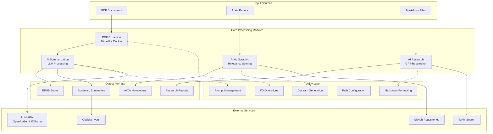

# Research Automation System Architecture

## System Overview
The Research Automation System is a comprehensive toolkit for academic research workflows, designed to automate paper processing, analysis, and knowledge management. The system integrates multiple AI services, document processing tools, and data analysis capabilities.

## High-Level Architecture



## Component Interaction Matrix

| Component | aisearch.py | summary.py | scrapt_arxiv.py | md_format.py | pdf_to_epub.py | utils/* |
|-----------|-------------|------------|-----------------|--------------|----------------|---------|
| **aisearch.py** | - | ❌ | ❌ | ❌ | ❌ | ✅ io, mermaid |
| **summary.py** | ❌ | - | ❌ | ❌ | ✅ called by | ✅ prompts, paths |
| **scrapt_arxiv.py** | ❌ | ❌ | - | ✅ uses | ❌ | ❌ |
| **md_format.py** | ❌ | ❌ | ✅ used by | - | ❌ | ❌ |
| **pdf_to_epub.py** | ❌ | ✅ calls | ❌ | ❌ | - | ✅ md_to_epub |
| **utils/*** | ✅ supports | ✅ supports | ❌ | ❌ | ✅ supports | - |

## Data Flow Architecture

### 1. PDF Processing Pipeline
```
PDF File → MinerU Docker → Markdown + Images → AI Analysis → Structured Summary
```

### 2. Research Enhancement Pipeline
```
Markdown Content → Query Generation → Web Research → Report Generation → Enhanced Document
```

### 3. ArXiv Newsletter Pipeline
```
ArXiv Query → Paper Fetching → Relevance Scoring → GitHub Detection → Formatted Newsletter
```

### 4. EPUB Creation Pipeline
```
PDF → Extraction → Summary Generation → EPUB Conversion → E-book Output
```

## Technology Stack

### Core Technologies
- **Python 3.11+**: Primary programming language
- **Docker**: Containerized PDF processing (MinerU)
- **LiteLLM**: Multi-provider LLM abstraction
- **SentenceTransformers**: Semantic similarity analysis

### AI/ML Services
- **OpenAI GPT Models**: Advanced text analysis
- **Google Gemini**: Alternative LLM provider
- **Ollama**: Local LLM deployment
- **GPT-Researcher**: Automated research framework

### Data Processing
- **ArXiv API**: Academic paper database
- **Tavily**: Web search and content extraction
- **BeautifulSoup**: HTML parsing
- **PyMuPDF**: PDF text extraction (legacy)

### Output Generation
- **EbookLib**: EPUB creation
- **Markdown**: Structured document format
- **Mermaid**: Diagram generation
- **ASCII Visualization**: Text-based charts

## Configuration Architecture

### Environment Configuration
```
.env (Primary)
├── API Keys (OpenAI, Gemini, Tavily)
├── Model Selection (SUMMARY_MODEL)
└── Path Configuration

.ai.env (AI Services)
├── LLM Model Settings (SMART_LLM, QUERY_LLM)
├── API Endpoints
└── Provider Configuration
```

### Path Structure
```
Vault/
├── Knowledge/
│   ├── automation/
│   │   ├── extract/          # PDF extraction output
│   │   └── output/           # Processed summaries
│   └── Papers/
│       └── Diggested_Papers/ # Final summaries
├── Templates/
│   └── summary.md           # Summary template
└── reports/                 # Research reports
```

## Security Architecture

### API Key Management
- Environment variable isolation
- Service-specific key separation
- Local model fallbacks

### Data Privacy
- Local processing where possible
- Configurable cloud service usage
- User data isolation

### Container Security
- Docker isolation for PDF processing
- Limited container permissions
- Temporary file cleanup

## Scalability Considerations

### Processing Capacity
- Batch processing support
- Configurable rate limiting
- Memory-efficient operations

### Service Integration
- Multiple LLM provider support
- Fallback mechanisms
- Load balancing capabilities

### Storage Management
- Intelligent caching
- Duplicate detection
- Cleanup automation

## Extension Points

### New Modules
1. **Search Providers**: Additional academic databases
2. **Output Formats**: New document formats
3. **AI Models**: Additional LLM integrations
4. **Analysis Tools**: Enhanced visualization

### Integration Hooks
- **Plugin Architecture**: Modular component design
- **Event System**: Processing pipeline hooks
- **Configuration System**: Runtime customization
- **API Interface**: External system integration

## Performance Metrics

### Processing Times
- **PDF Extraction**: 30-120 seconds (depends on complexity)
- **AI Summarization**: 15-60 seconds (depends on model)
- **ArXiv Scraping**: 10-30 seconds (depends on query size)
- **EPUB Generation**: 5-15 seconds

### Resource Usage
- **Memory**: 2-8GB (depends on models loaded)
- **Storage**: Variable (depends on document size)
- **Network**: API-dependent
- **CPU**: Model inference workload

## Quality Assurance

### Error Handling
- Graceful degradation
- Comprehensive logging
- User feedback mechanisms
- Automatic recovery

### Validation
- Input sanitization
- Output verification
- Format compliance
- Data integrity checks

## Future Architecture Evolution

### Planned Enhancements
1. **Microservices Architecture**: Service decomposition
2. **Event-Driven Processing**: Asynchronous workflows
3. **Database Integration**: Persistent storage layer
4. **Web Interface**: Browser-based access
5. **API Gateway**: Unified service access