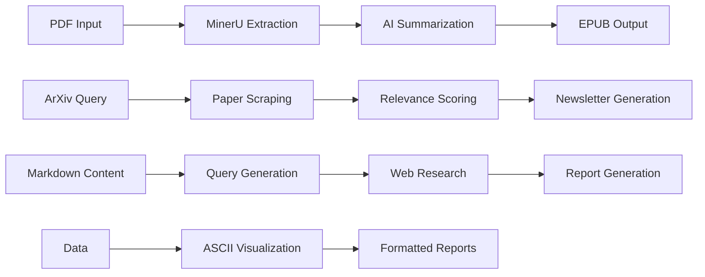

# Research Automation System - Product Requirements Document

## Executive Summary

The Research Automation System is a comprehensive toolkit designed to streamline academic research workflows through AI-powered document processing, analysis, and knowledge management. The system automates the extraction, summarization, and enhancement of research papers, making academic literature more accessible and actionable.

## Product Vision

**Mission**: To democratize access to academic knowledge by automating research workflows and providing intelligent document processing capabilities.

**Vision**: A unified platform that transforms how researchers discover, process, and synthesize academic literature, reducing manual effort while improving comprehension and accessibility.

## System Architecture Overview

### Core Components

| Component | Role | Primary Function | Key Technologies |
|-----------|------|------------------|------------------|
| **aisearch.py** | AI Research Engine | Web research and report generation | GPT-Researcher, Tavily |
| **summary.py** | Document Processor | PDF to markdown conversion and AI summarization | MinerU, LiteLLM |
| **scrapt_arxiv.py** | Content Discovery | ArXiv paper scraping and relevance scoring | ArXiv API, SentenceTransformers |
| **md_format.py** | Visualization Engine | ASCII charts and data visualization | NumPy, Matplotlib |
| **pdf_to_epub.py** | Format Converter | PDF to EPUB conversion pipeline | EbookLib, Custom utilities |
| **utils/** | Supporting Infrastructure | I/O, prompts, paths, conversions | Various utilities |

### System Integration Flow



## Detailed Component Specifications

### 1. AI Research Engine (aisearch.py)

#### Purpose
Conducts automated research on topics by analyzing markdown content, generating queries, and producing comprehensive reports with internet research.

#### Core Functions
- **`get_report(query: str, report_type: str)`**: Executes research pipeline
- **`get_md_query(prompt: str, file_path: str)`**: Generates research queries
- **`scrape_pages(urls: list[str])`**: Extracts web content
- **`validate_diagram(report: str)`**: Creates Mermaid diagrams

#### Configuration Requirements
- **.ai.env**: SMART_LLM, QUERY_LLM, TAVILY_API_KEY, GOOGLE_API_KEY
- **Model Support**: OpenAI, Gemini, Ollama via LiteLLM
- **Report Types**: research_report, resource_report, outline_report, custom_report, detailed_report, subtopic_report

#### Usage Pattern
```bash
python aisearch.py <dir_path> <markdown_file> <report_type>
```

#### Integration Points
- **Obsidian**: Python Scripter plugin compatibility
- **Web Search**: Tavily API integration
- **Diagrams**: Mermaid visualization generation

### 2. Document Processor (summary.py)

#### Purpose
Processes PDF documents by converting them to markdown and generating AI-powered academic summaries with structured analysis.

#### Core Functions
- **`process_single_md(...)`**: Main processing pipeline for markdown analysis
- **PDF Extraction**: MinerU Docker integration
- **Template System**: Configurable output formatting
- **Figure Management**: Image and table preservation

#### Configuration Requirements
- **.env**: SUMMARY_MODEL (default: "gemini/gemini-2.0-flash")
- **Paths**: Configurable via utils/summary_path.py
- **Templates**: Structured academic analysis templates
- **Prompts**: Computer vision specialized prompts

#### Processing Pipeline
1. **PDF → Markdown**: MinerU Docker extraction
2. **Content Analysis**: Figure and table processing
3. **AI Summarization**: Structured academic analysis
4. **Output Generation**: Formatted summary files

#### Usage Pattern
```bash
python summary.py <vault_path> <pdf_file>
```

### 3. Content Discovery Engine (scrapt_arxiv.py)

#### Purpose
Fetches recent papers from ArXiv, performs relevance scoring using semantic similarity, and generates formatted research newsletters.

#### Core Functions
- **`get_recent_arxiv_links_with_arxivpy(...)`**: ArXiv paper fetching
- **`score_papers_with_transformers(...)`**: Semantic relevance analysis
- **`detect_github_in_papers(...)`**: Repository detection
- **`generate_newsletter_content(...)`**: Newsletter formatting

#### Scoring Methodology
- **Semantic Similarity**: SentenceTransformers embedding comparison
- **Threshold Filtering**: Configurable relevance thresholds
- **GitHub Integration**: Automatic repository detection
- **Ranking System**: Score-based paper prioritization

#### Output Format
Structured markdown newsletters with:
- Categorized papers by relevance score
- GitHub repository links
- Abstract summaries
- Publication metadata

### 4. Visualization Engine (md_format.py)

#### Purpose
Creates ASCII-based visualizations for data analysis, including histograms and scatter plots for integration into markdown reports.

#### Core Functions
- **`create_ascii_histogram(...)`**: Text-based histogram generation
- **`create_ascii_scatter_plot(...)`**: ASCII scatter plot creation
- **`format_score_distribution(...)`**: Statistical distribution formatting
- **`generate_summary_statistics(...)`**: Descriptive statistics

#### Visualization Features
- **ASCII Charts**: Terminal-compatible visualizations
- **Statistical Analysis**: Mean, median, std dev, quartiles
- **Customizable Output**: Configurable dimensions and formatting
- **Integration Ready**: Markdown-compatible output

### 5. Format Converter (pdf_to_epub.py)

#### Purpose
Converts PDF documents to EPUB format through MinerU extraction and AI summarization integration.

#### Core Functions
- **`pdf_to_epub(pdf_path: str, output_path: str = None)`**: Main conversion pipeline

#### Processing Steps
1. **PDF Extraction**: MinerU Docker integration
2. **Summary Generation**: AI-powered analysis (planned)
3. **EPUB Creation**: Multi-source markdown compilation
4. **Metadata Management**: Bibliographic information

#### Output Structure
- **Full Text**: Complete extracted content
- **Summary**: AI-generated analysis
- **Images**: Embedded figures and diagrams
- **Metadata**: Academic paper information

### 6. Supporting Infrastructure (utils/)

#### Module Organization
- **io.py**: File handling and Obsidian integration
- **summary_prompts.py**: AI prompt templates and configurations
- **summary_path.py**: Directory structure definitions
- **md_to_epub.py**: EPUB conversion utilities
- **create_mermaid.py**: Diagram generation and validation

#### Configuration Management
- **Prompt Templates**: Academic analysis frameworks
- **Tag Systems**: Categorization hierarchies
- **Path Management**: Flexible directory structures
- **Format Conversion**: Multi-format support

## System Requirements

### Technical Requirements
- **Python**: 3.11+ with pip/uv package management
- **Docker**: For MinerU PDF extraction container
- **Memory**: 2-8GB RAM (depends on AI models)
- **Storage**: Variable (depends on document collection)

### API Dependencies
- **OpenAI**: GPT models for text analysis
- **Google Gemini**: Alternative LLM provider
- **Tavily**: Web search and content extraction
- **ArXiv**: Academic paper database access

### Environment Configuration
```bash
# Primary configuration (.env)
SUMMARY_MODEL=gemini/gemini-2.0-flash
OPENAI_API_KEY=your_key_here
GOOGLE_API_KEY=your_key_here
TAVILY_API_KEY=your_key_here

# AI services configuration (.ai.env)
SMART_LLM=google_genai:gemini-2.0-flash
QUERY_LLM=ollama:phi4
OLLAMA_BASE_URL=http://localhost:11434
```

## Installation and Setup

### Quick Start
```bash
# 1. Install dependencies
pip install -r requirements.txt

# 2. Build MinerU container
docker build -t mineru:latest .

# 3. Configure environment
cp .env.example .env
cp .ai.env.example .ai.env
# Edit configuration files with your API keys

# 4. Run components
python summary.py /path/to/vault paper.pdf
python aisearch.py /path/to/vault file.md research_report
python scrapt_arxiv.py --config queries.json
```

### Directory Structure Setup
```
Vault/
├── Knowledge/
│   ├── automation/
│   │   ├── extract/
│   │   └── output/
│   └── Papers/
│       └── Diggested_Papers/
├── Templates/
│   └── summary.md
└── reports/
```

## Usage Examples

### Academic Paper Processing
```bash
# Extract and summarize a PDF
python summary.py ~/vault research_paper.pdf

# Generate research report on a topic
python aisearch.py ~/vault topic.md research_report

# Create EPUB from PDF
python pdf_to_epub.py research_paper.pdf
```

### Research Newsletter Generation
```bash
# Scrape ArXiv and generate newsletter
python scrapt_arxiv.py --config computer_vision_queries.json
```

### Integration Examples
```python
# Programmatic usage
from summary import process_single_md
from pdf_to_epub import pdf_to_epub

# Process paper
epub_path = pdf_to_epub("paper.pdf")
print(f"EPUB created: {epub_path}")
```

## Performance Characteristics

### Processing Times
- **PDF Extraction**: 30-120 seconds
- **AI Summarization**: 15-60 seconds
- **Research Report**: 60-180 seconds
- **ArXiv Newsletter**: 10-30 seconds

### Quality Metrics
- **Extraction Accuracy**: >95% text preservation
- **Summary Relevance**: Human-evaluated quality scores
- **Research Depth**: Comprehensive internet research integration
- **Format Fidelity**: Preservation of academic structure

## Security and Privacy

### Data Protection
- **Local Processing**: Maximizes data privacy
- **API Security**: Secure key management
- **Container Isolation**: Docker security boundaries
- **Temporary Files**: Automatic cleanup

### Configuration Security
- **Environment Variables**: Isolated API key storage
- **Service Isolation**: Separate configuration files
- **Access Control**: File permission management

## Future Roadmap

### Planned Enhancements
1. **Web Interface**: Browser-based document processing
2. **Database Integration**: Persistent knowledge management
3. **Batch Processing**: High-volume document handling
4. **Advanced Analytics**: Enhanced visualization capabilities
5. **API Gateway**: Unified service access
6. **Plugin Architecture**: Extensible module system

### Integration Opportunities
- **Zotero**: Reference management integration
- **Notion**: Knowledge base synchronization
- **Slack/Discord**: Automated research updates
- **GitHub**: Code repository analysis

## Support and Documentation

### Documentation Structure
- **Component READMEs**: Individual module documentation
- **Architecture Guide**: System design overview
- **API Reference**: Function signatures and parameters
- **Usage Examples**: Practical implementation guides
- **Configuration Guide**: Setup and customization

### Community Resources
- **GitHub Repository**: Source code and issues
- **Documentation Site**: Comprehensive guides
- **Example Configurations**: Template files
- **Video Tutorials**: Step-by-step walkthroughs

---

This PRD serves as the definitive guide to the Research Automation System, providing comprehensive documentation of its architecture, components, and usage patterns for both users and developers.