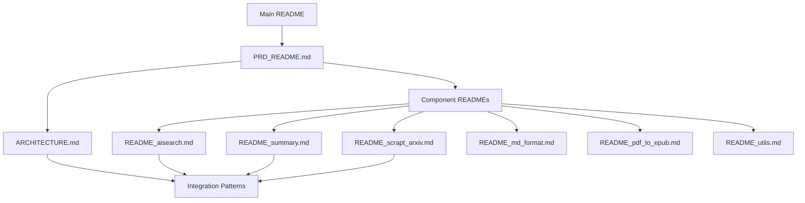

# Documentation Index

This directory contains comprehensive documentation for the Research Automation System. The documentation is organized as a Product Requirements Document (PRD) with detailed technical specifications for each component.

## 📖 Documentation Structure

### Primary Documentation
- **[PRD_README.md](PRD_README.md)** - Complete Product Requirements Document with system overview, architecture, and specifications
- **[ARCHITECTURE.md](ARCHITECTURE.md)** - Technical architecture overview with component interactions and data flows

### Component Documentation
- **[README_aisearch.md](README_aisearch.md)** - AI Research Engine (aisearch.py)
- **[README_summary.md](README_summary.md)** - PDF Processing and Summarization (summary.py)
- **[README_scrapt_arxiv.md](README_scrapt_arxiv.md)** - ArXiv Paper Discovery (scrapt_arxiv.py)
- **[README_md_format.md](README_md_format.md)** - Data Visualization Utilities (md_format.py)
- **[README_pdf_to_epub.md](README_pdf_to_epub.md)** - Document Format Conversion (pdf_to_epub.py)
- **[README_utils.md](README_utils.md)** - Supporting Utility Modules (utils/)

## 🗺️ Reading Guide

### For New Users
1. Start with the main [README.md](../readme.md) for quick start instructions
2. Read [PRD_README.md](PRD_README.md) for comprehensive system overview
3. Check specific component documentation based on your use case

### For Developers
1. Review [ARCHITECTURE.md](ARCHITECTURE.md) for technical architecture
2. Study component-specific READMEs for implementation details
3. Check function signatures and API references in each module document

### For System Administrators
1. Focus on configuration sections in [PRD_README.md](PRD_README.md)
2. Review environment setup in component documentation
3. Check requirements and dependencies in [ARCHITECTURE.md](ARCHITECTURE.md)

## 📊 Documentation Completeness

| Component | API Reference | Usage Examples | Configuration | Architecture |
|-----------|---------------|----------------|---------------|-------------|
| aisearch.py | ✅ | ✅ | ✅ | ✅ |
| summary.py | ✅ | ✅ | ✅ | ✅ |
| scrapt_arxiv.py | ✅ | ✅ | ✅ | ✅ |
| md_format.py | ✅ | ✅ | ✅ | ✅ |
| pdf_to_epub.py | ✅ | ✅ | ✅ | ✅ |
| utils/ | ✅ | ✅ | ✅ | ✅ |

## 🔄 Document Relationships

## 📝 Documentation Standards

### Format Guidelines
- **Markdown**: All documentation in markdown format
- **Structure**: Consistent section organization across components
- **Code Examples**: Working code snippets with proper formatting
- **Mermaid Diagrams**: Visual architecture and flow diagrams

### Content Standards
- **Function Signatures**: Complete parameter and return type documentation
- **Usage Examples**: Practical implementation examples
- **Configuration**: Environment variables and setup instructions
- **Error Handling**: Common issues and troubleshooting

## 🤝 Contributing to Documentation

### Adding New Documentation
1. Follow existing naming conventions (README_component.md)
2. Use the established section structure
3. Include function signatures, examples, and configuration
4. Update this index file with new documentation

### Updating Existing Documentation
1. Maintain consistency with existing format
2. Update related documentation for cross-references
3. Test all code examples before committing
4. Update version information if applicable

## 📚 Additional Resources

### External Documentation
- [GPT-Researcher](https://github.com/assafelovic/gpt-researcher) - AI research framework
- [MinerU](https://github.com/opendatalab/MinerU) - PDF extraction tool
- [LiteLLM](https://docs.litellm.ai/) - Multi-provider LLM interface
- [ArXiv API](https://arxiv.org/help/api) - Academic paper database

### Community Resources
- GitHub Issues for bug reports and feature requests
- Discussion forums for implementation questions
- Example configurations in demo/ directory
- Video tutorials (planned)

---

**Last Updated**: [Current Date]  
**Documentation Version**: 1.0  
**System Version**: Latest