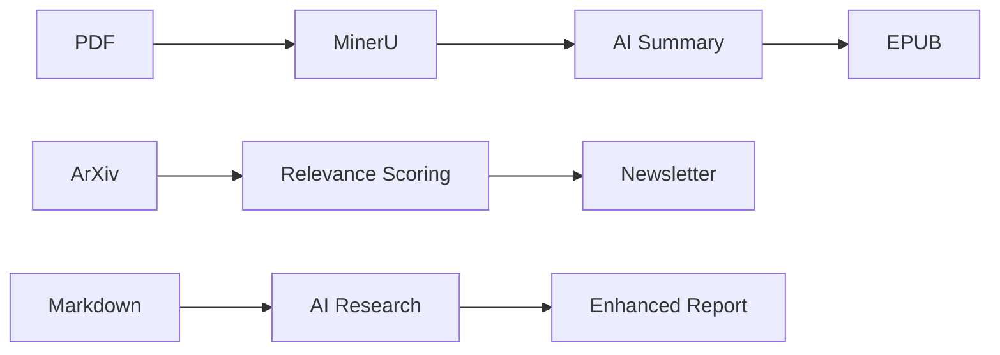

# Research Automation System

This repository contains a comprehensive toolkit for automating academic research workflows, including PDF processing, AI-powered summarization, ArXiv scraping, and document format conversion.

## 📖 Complete Documentation

For comprehensive documentation including architecture, API references, and detailed component specifications, see:

- **[📋 Product Requirements Document (PRD)](docs/PRD_README.md)** - Complete system overview and specifications
- **[🏗️ System Architecture](docs/ARCHITECTURE.md)** - Technical architecture and component interactions
- **[🔍 AiSearch Module](docs/README_aisearch.md)** - AI-powered research automation
- **[📄 Summary Module](docs/README_summary.md)** - PDF processing and summarization
- **[📊 ArXiv Scraper](docs/README_scrapt_arxiv.md)** - Academic paper discovery and analysis
- **[📈 Markdown Formatting](docs/README_md_format.md)** - Data visualization utilities
- **[📚 PDF to EPUB](docs/README_pdf_to_epub.md)** - Document format conversion
- **[🛠️ Utility Modules](docs/README_utils.md)** - Supporting infrastructure

## System Overview

The Research Automation System provides four main capabilities:

1. **📄 PDF Processing**: Convert PDFs to markdown and generate AI summaries
2. **🔍 AI Research**: Enhance documents with internet research and analysis  
3. **📊 ArXiv Discovery**: Scrape and analyze academic papers with relevance scoring
4. **📚 Format Conversion**: Convert documents to EPUB for easy reading


## 🚀 Quick Start

### 1. Install Dependencies
```bash
pip install -r requirements.txt
```

### 2. Build MinerU Docker Container
```bash
docker build -t mineru:latest .
```

### 3. Configure Environment
```bash
# Copy example configuration files
cp .env.example .env
cp .ai.env.example .ai.env

# Edit with your API keys
# .env: SUMMARY_MODEL, API keys for OpenAI/Gemini/Tavily
# .ai.env: SMART_LLM, QUERY_LLM, API endpoints
```

### 4. Usage Examples

#### Process a PDF Paper
```bash
python summary.py /path/to/vault paper.pdf
```

#### Generate AI Research Report
```bash
python aisearch.py /path/to/vault topic.md research_report
```

#### Scrape ArXiv for Papers
```bash
python scrapt_arxiv.py --config demo/demo_queries.md
```

#### Convert PDF to EPUB
```bash
python pdf_to_epub.py paper.pdf
```

### 5. Integration with Obsidian
Compatible with Obsidian Python Scripter plugin. Pass vault path and active file path as arguments.

## 📂 Key Components

| File | Purpose | Description |
|------|---------|-------------|
| **aisearch.py** | AI Research Engine | Conducts automated research using GPT-Researcher and web search |
| **summary.py** | PDF Processor | Converts PDFs to markdown and generates AI summaries |
| **scrapt_arxiv.py** | ArXiv Scraper | Fetches and analyzes academic papers with relevance scoring |
| **md_format.py** | Visualization | Creates ASCII charts and data visualizations |
| **pdf_to_epub.py** | Format Converter | Converts PDFs to EPUB format for e-readers |
| **utils/** | Supporting Code | I/O operations, prompts, paths, and utilities |

**📖 For detailed documentation of each component, see the [docs/](docs/) directory.**

## 🔧 Configuration

The system uses two main configuration files:

### .env (Primary Configuration)
```bash
SUMMARY_MODEL=gemini/gemini-2.0-flash
OPENAI_API_KEY=your_key_here
GOOGLE_API_KEY=your_key_here
TAVILY_API_KEY=your_key_here
```

### .ai.env (AI Services)
```bash
SMART_LLM=google_genai:gemini-2.0-flash
QUERY_LLM=ollama:phi4
OLLAMA_BASE_URL=http://localhost:11434
```

## 🏗️ System Architecture



## 🛠️ Requirements

- **Python 3.11+**
- **Docker** (for MinerU PDF processing)
- **API Keys**: OpenAI, Google Gemini, or Tavily (depending on usage)
- **Memory**: 2-8GB RAM (varies by AI model)

## 🎯 Use Cases

- **Academic Research**: Automated paper processing and analysis
- **Knowledge Management**: Obsidian vault integration
- **Literature Review**: ArXiv paper discovery and summarization  
- **E-book Creation**: PDF to EPUB conversion for reading
- **Research Reports**: AI-enhanced topic analysis

## 🤝 Contributing

1. Review the [Architecture Documentation](docs/ARCHITECTURE.md)
2. Check component-specific READMEs in [docs/](docs/)
3. Follow existing code patterns and documentation standards
4. Submit PRs with comprehensive documentation updates

## 📄 License

[Add your license information here]

---

**📖 For complete documentation, API references, and implementation details, see the [Product Requirements Document](docs/PRD_README.md).**